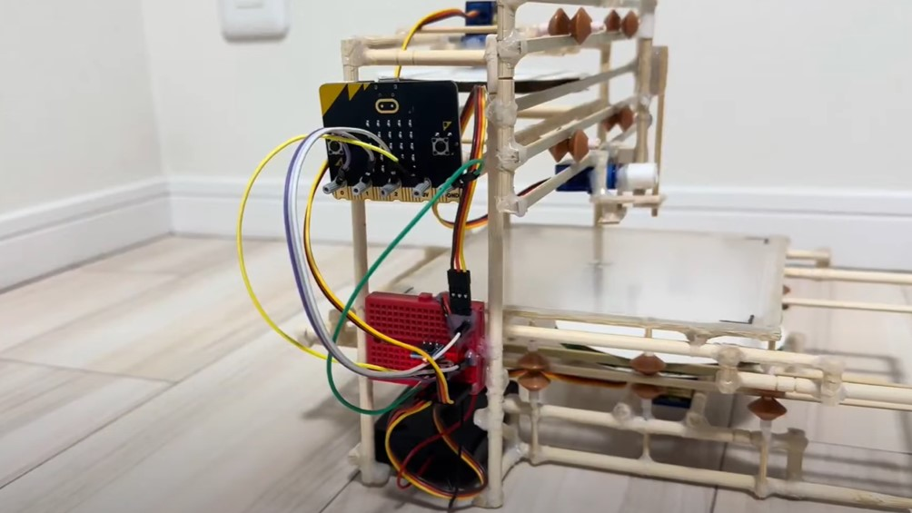
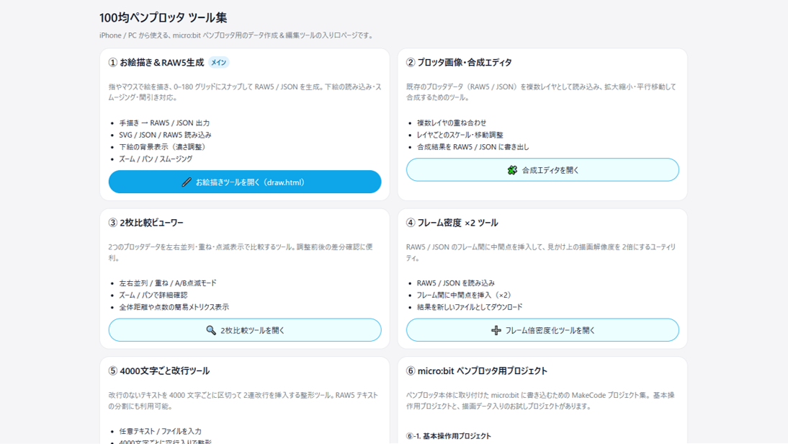
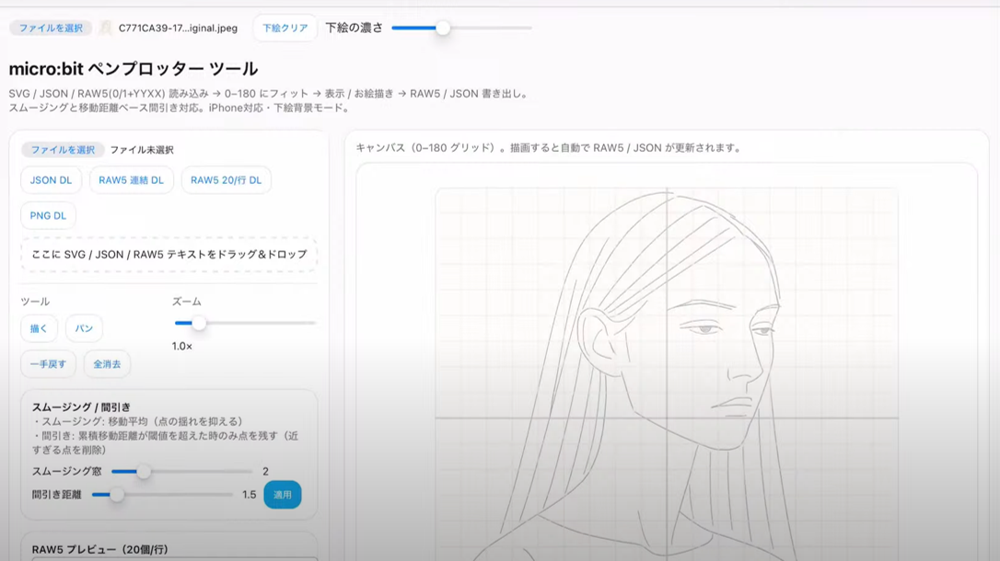
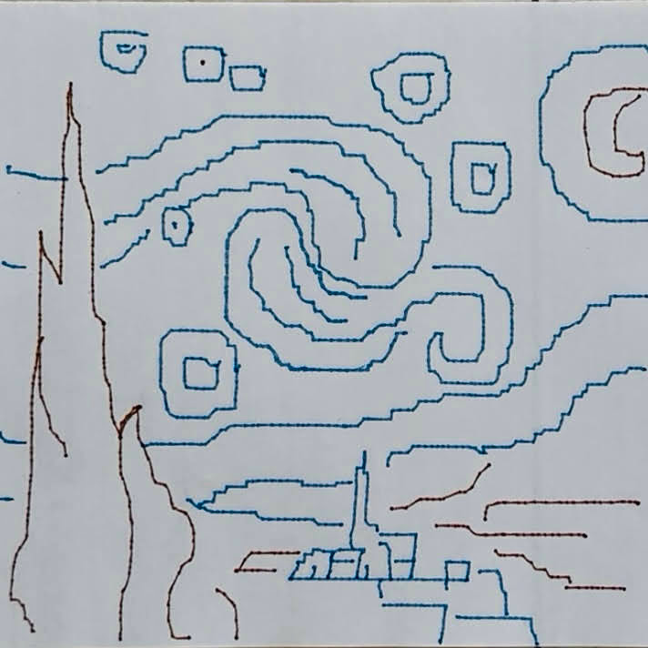

## これは
* 100均素材とmicro:bitで作ったペンプロッター用のお役立ちツール集です．

[Youtube](https://youtu.be/s1bQL_ALQ78)

[Protopedia](https://protopedia.net/prototype/7660)

## フォトギャラリー
### ペンプロッター本体

### micro:bit

### ペンプロッターツール

### 作品例

