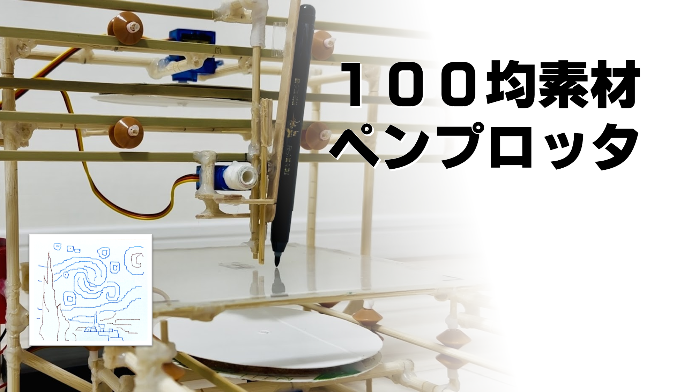
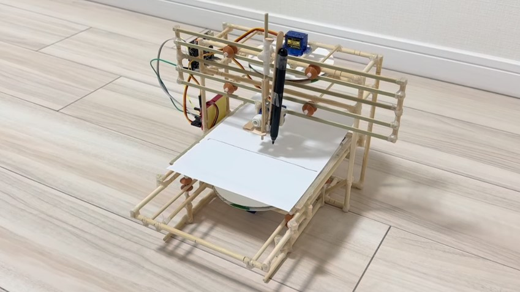
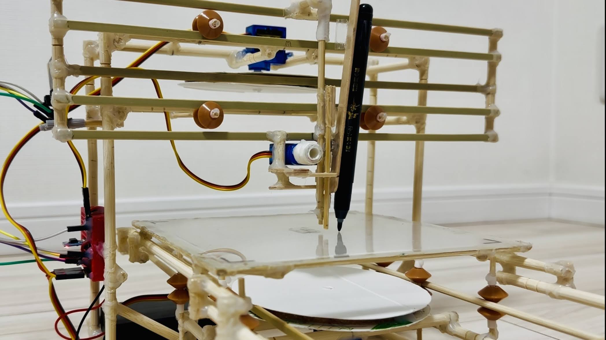
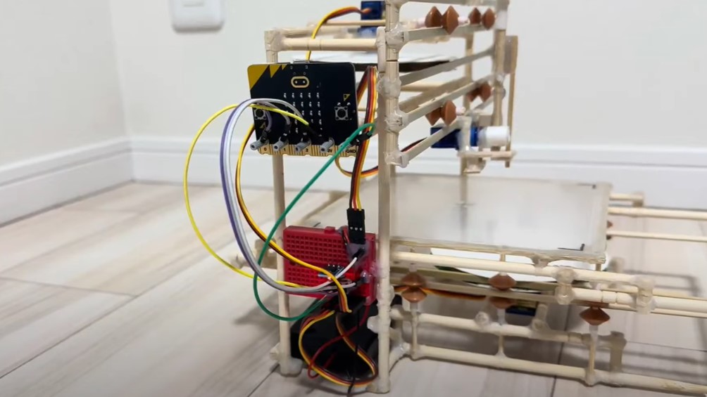
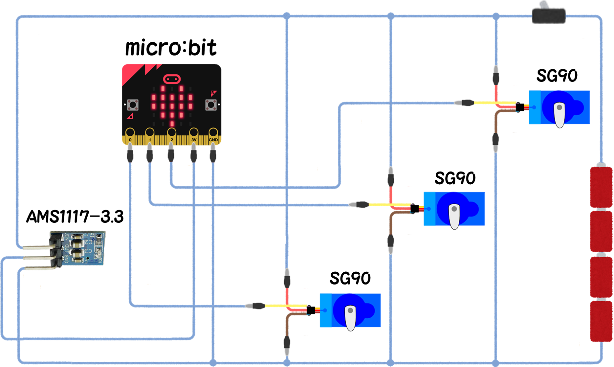
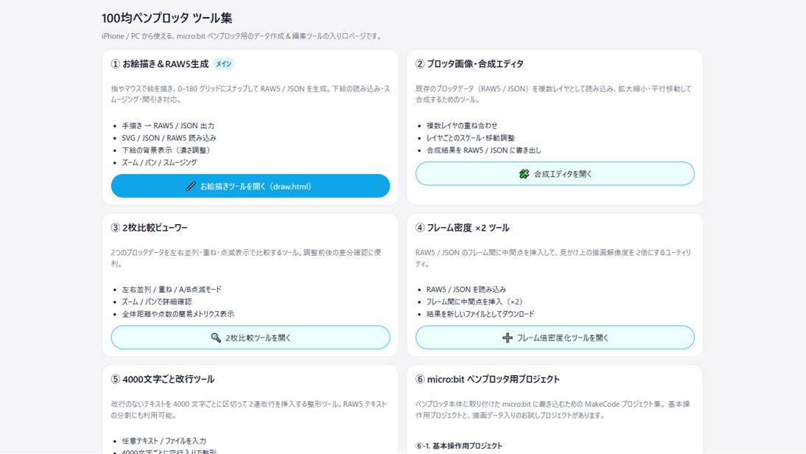
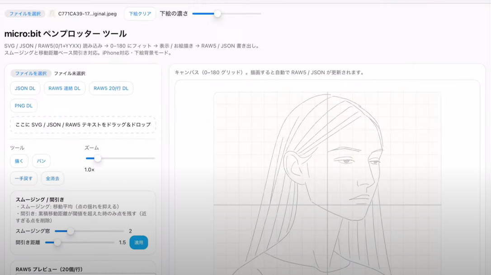
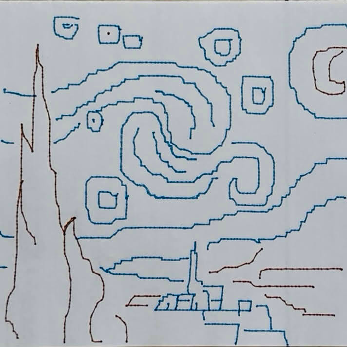

## これは
* 100均素材とmicro:bitで作ったペンプロッター用のお役立ちツール集です．

[Youtube](https://youtu.be/s1bQL_ALQ78)

[Protopedia](https://protopedia.net/prototype/7660)

[ペンプロッターツール集](https://katabomb.github.io/microbit-plotter-tools/)

[RAW5 Viewer/Converter](https://katabomb.github.io/microbit-plotter-tools/preview.html)
RAW5正式仕様（PYYXX / 1フレーム5文字）をそのまま扱う単一HTMLアプリです．空白・改行を無視して読み込み，連結RAW5 / 20フレームごと改行RAW5 を書き出せます．

## フォトギャラリー
### ペンプロッター本体

### micro:bit

### 回路図

### ペンプロッターツール

### 作品例

