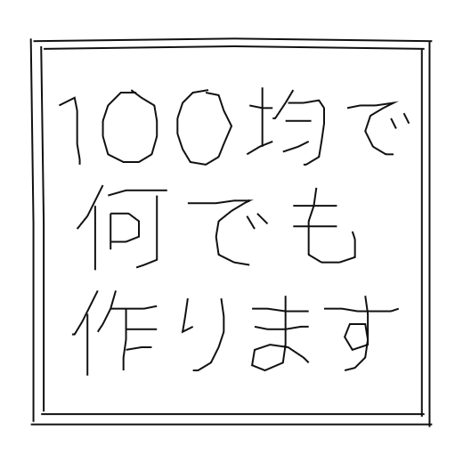
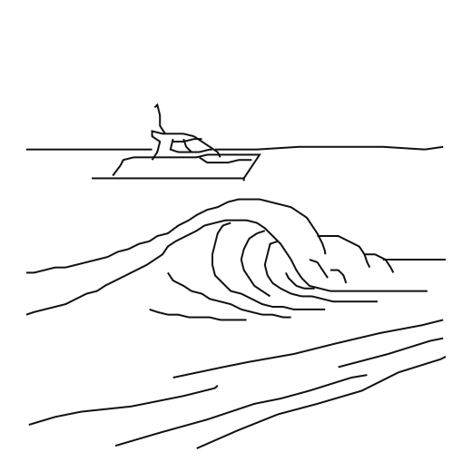
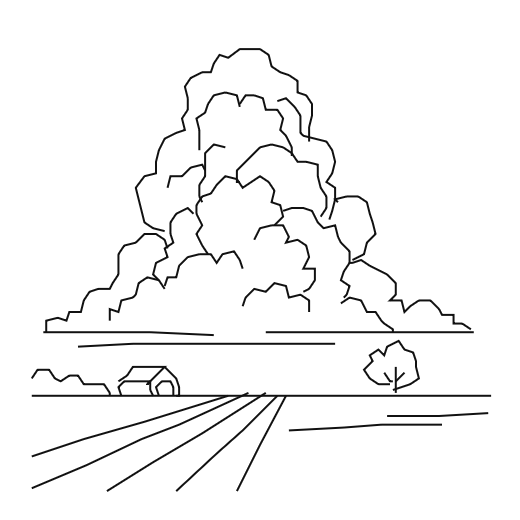
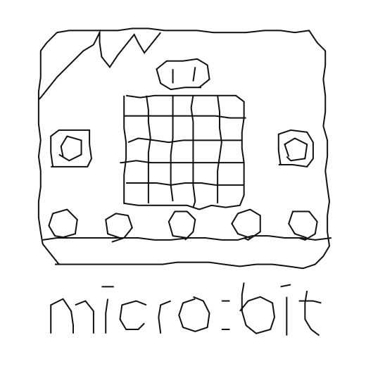
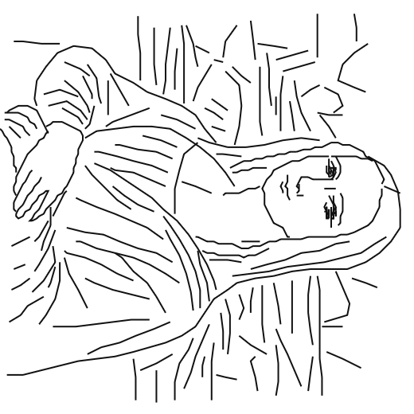
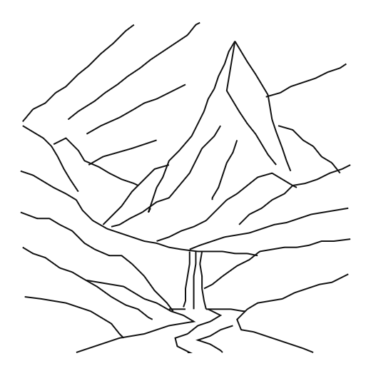

## ここには100均ペンプロッタのサンプルデータを置いてます
* .png画像はペンプロッタツールで描画用データを画像に起こしたものです．
* .元画（に近い）は手描きのデータもしくはそれを少し加工したデータです．
* 描画用はペンプロッタ出力用のデータです．
* MakeCodeはデータ入りのmicro:bitプロジェクトです（.hexファイル）．
* .hexファイルをmicro:bitに読み込めばそのまま絵が描けます（もちろんペンプロッタは必要です）．

|タイトル|.png画像|元画（に近い）|描画用|MakeCode|
|:---:|:---:|:---:|:---:|:---:|
|100均で何でも作ります||[100kinmoji.txt](100kin/100kinmoji.txt) [100kinwaku.txt](100kin/100kinwaku.txt)|[100kin2.txt](100kin/100kin2.txt)|[100kin.hex](100kin/100kin.hex)|
|聖夜|||[christmas.txt](Christmas/christmas.txt)|[christmas.hex](Christmas/christmas.hex)|
|波とクルーザー|||[cruiser.txt](cruiser/cruiser.txt)|[cruiser.hex](cruiser/cruiser.hex)|
|浜辺||[hamabe.txt](hamabe/hamabe.txt)|[hamabe3.txt](hamabe/hamabe3.txt)|[hamabe.hex](hamabe/hamabe.hex)|
|信号の消えた街|||[heya2.txt](heya/heya2.txt)|[heya.hex](heya/heya.hex)|
|星月夜||[hoshitsukiyoBL.txt](hoshitsukiyo/hoshitsukiyoBL.txt)|[hoshitsukiyoBR.txt](hoshitsukiyo/hoshitsukiyoBR.txt) [hoshitsukiyoBL4.txt](hoshitsukiyo/hoshitsukiyoBL4.txt)|[hoshitsukiyoBR.hex](hoshitsukiyo/hoshitsukiyoBR.hex) [hoshitsukiyoBL.hex](hoshitsukiyo/hoshitsukiyoBL.hex)|
|入道雲と家|||[ietokumo.txt](ietokumo/ietokumo.txt)|[ietokumo.hex](ietokumo/ietokumo.hex)|
|沈黙の受胎告知||[jutaikokuchi.txt](jutaikokuchi/jutaikokuchi.txt)|[jutaikokuchi2.txt](jutaikokuchi/jutaikokuchi2.txt)|[jutaikokuchi.hex](jutaikokuchi/jutaikokuchi.hex)|
|micro:bit||[microbit.txt](microbit/microbit.txt)|[microbit3.txt](microbit/microbit3.txt)|[microbit.hex](microbit/microbit.hex)|
|モナリザ||[monalisa.txt](monalisa/monsalisa.txt)|[monsalisa5.txt](monalisa/monalisa5.txt)|[monalisaA.hex](monalisa/monalisaA.hex) [monalisaB.hex](monalisa/monalisaB.hex) [monalisaC.hex](monalisa/monalisaC.hex)|
|モナリザ（線描）||[monhaikei.txt](monaline/monhaikei.txt) [mondo.txt](monaline/mondo.txt) [monte.txt](monaline/monte.txt) [monkao.txt](monaline/monkao.txt)|[mon.txt](monaline/mon.txt)|[monaline.hex](monaline/monaline.hex)|
|斜位||[shai1.txt](shai/shai1.txt)|[shai4.txt](shai/shai4.txt)|[shai.hex](shai/shai.hex)|
|座るひと||[suwaruhito.txt](suwaruhito/suwaruhito.txt)|[suwaruhito3.txt](suwaruhito/suwaruhito3.txt)|[suwaruhito.hex](suwaruhito/suwaruhito.hex)|
|干支の午||[uma.txt](uma/uma.txt)|[uma1.txt](uma/uma1.txt) [uma2.txt](uma/uma2.txt)|[uma.hex](uma/uma.hex)|
|山|||[yama.txt](yama/山.txt)|[yama.hex](yama/yama.hex)|
