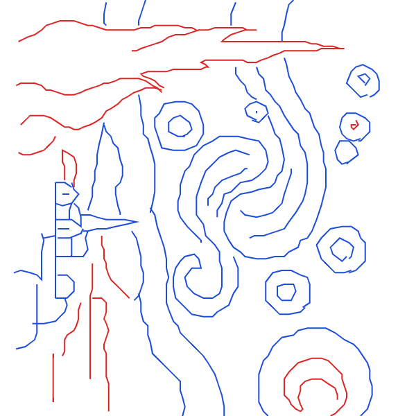

## ここには100均ペンプロッタのサンプルデータを置いてます
* .txtはmicrobitペンプロッタツールで読み込める画像データが入ってることが多いです．
* .pngはそのpng画像．
* .txtは圧縮前と圧縮後のデータが入っていることが多いです．ファイルサイズが参考になります．どんな画像かはペンプロッタツールで読み込んで確認してみてね．
* .hexにはmicrobitの画像データ入りのプロジェクトです．

|.png画像|元画（に近い）|描画用1|描画用2|その他|
|:---:|:---:|:---:|:---:|:---:|
|||[星月夜線描青_every-4000.txt](hoshitsukiyo/星月夜線描青_every-4000.txt)|[星月夜線描茶.txt](hoshitsukiyo/星月夜線描茶.txt)|[星月夜線描青.txt](hoshitsukiyo/星月夜線描青.txt)|
|||[モナリザ線描.txt](monalisa_line/モナリザ線描.txt)||
||[斜位1.txt](shai/斜位1.txt)|[斜位4.txt](shai/斜位4.txt)||
||[タイトル](リンク先URL)|[タイトル](リンク先URL)|[タイトル](リンク先URL)|
||[タイトル](リンク先URL)|[タイトル](リンク先URL)|[タイトル](リンク先URL)|
||[タイトル](リンク先URL)|[タイトル](リンク先URL)|[タイトル](リンク先URL)|
||[タイトル](リンク先URL)|[タイトル](リンク先URL)|[タイトル](リンク先URL)|
||[タイトル](リンク先URL)|[タイトル](リンク先URL)|[タイトル](リンク先URL)|
