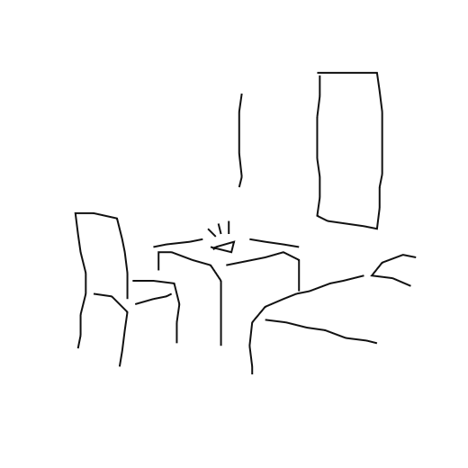

## ここには100均ペンプロッタのサンプルデータを置いてます
* .png画像はペンプロッタツールで描画用データを画像に起こしたものです．
* .元画（に近い）は手描きのデータもしくはそれを少し加工したデータです．
* 描画用1，2はペンプロッタ出力用のデータです．
* MakeCodeはデータ入りのmicro:bitプロジェクトです（.hexファイル）．
* .hexファイルをmicro:bitに読み込めばそのまま絵が描けます（もちろんペンプロッタは必要です）．

|.png画像|元画（に近い）|描画用1|描画用2|MakeCode|
|:---:|:---:|:---:|:---:|:---:|
|||[クリスマス.txt](Christmas/クリスマス.txt)||[christmas.hex](Christmas/christmas.hex)|
|||[cruiser.txt](cruiser/cruiser.txt)||[cruiser.hex](cruiser/cruiser.hex)|
||[浜辺.txt](hamabe/浜辺.txt)|[浜辺3.txt](hamabe/浜辺3.txt)||[hamabe.hex](hamabe/hamabe.hex)|
|||[信号の消えた街2.txt](heya/信号の消えた街2.txt)||[heya.hex](heya/heya.hex)|
||[星月夜線描青.txt](hoshitsukiyo/星月夜線描青.txt)|[星月夜線描茶.txt](hoshitsukiyo/星月夜線描茶.txt)|[星月夜線描青4.txt](hoshitsukiyo/星月夜線描青4.txt)|[hoshitsukiyoBR.hex](hoshitsukiyo/hoshitsukiyoBR.hex) [hoshitsukiyoBL.hex](hoshitsukiyo/hoshitsukiyoBL.hex)|
|||[入道雲と家.txt](ietokumo/入道雲と家.txt)||[ietokumo.hex](ietokumo/ietokumo.hex)|
||[沈黙の受胎告知.txt](jutaikokuchi/沈黙の受胎告知.txt)|[沈黙の受胎告知2.txt](jutaikokuchi/沈黙の受胎告知2.txt)||[jutaikokuchi.hex](jutaikokuchi/jutaikokuchi.hex)|
||[microbit.txt](microbit/microbit.txt)|[microbit3.txt](microbit/microbit3.txt)||[microbit.hex](microbit/microbit.hex)|
||[monalisa.txt](monalisa/monsalisa.txt)|[monsalisa5.txt](monalisa/monalisa5.txt)||[monalisaA.hex](monalisa/monalisaA.hex) [monalisaB.hex](monalisa/monalisaB.hex) [monalisaC.hex](monalisa/monalisaC.hex)|
|||[monalisaline.txt](monalisa_line/monalisaline.txt)||[monalisaline.hex](monalisa_line/monalisaline.hex)|
||[斜位1.txt](shai/斜位1.txt)|[斜位4.txt](shai/斜位4.txt)||[shai.hex](shai/shai.hex)|
||[座るひと.txt](suwaruhito/座るひと.txt)|[座るひと3.txt](suwaruhito/座るひと3.txt)||[suwaruhito.hex](suwaruhito/suwaruhito.hex)|
|||[山.txt](yama/山.txt)||[yama.hex](yama/yama.hex)|
